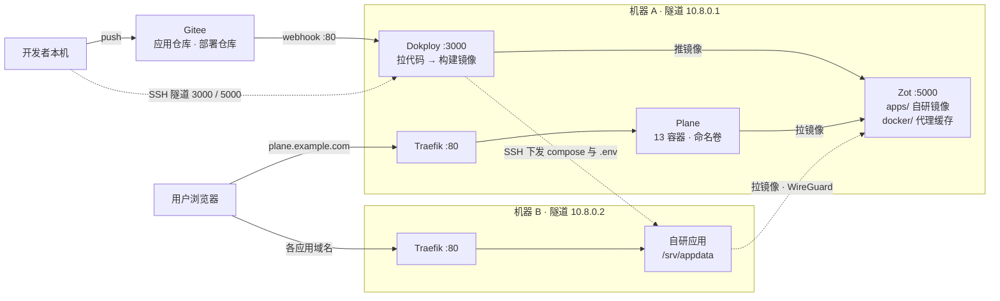

# devops：Dokploy + Zot 双机部署

**机器 A** 是控制平面（Dokploy 构建、Zot 镜像仓库、Traefik），并跑 Plane；**机器 B** 跑自研应用。服务落在哪台由 Dokploy 服务的 `Server` 字段决定。全站 HTTP，两机之间走 WireGuard 隧道，Dokploy 面板与 Zot UI 只经 SSH 隧道访问。

## 架构

镜像只有一个产地：Dokploy 在机器 A 构建后推 Zot，两台机器都从 Zot 拉，公共镜像也经它的 `docker/` 前缀回源缓存。

## 文档

| 文档 | 内容 |
|---|---|
| [docs/deploy.md](docs/deploy.md) | 全部部署操作步骤，从零到跑起来，唯一来源 |
| [docs/layout.md](docs/layout.md) | 代码、部署文件、变量、镜像、CI/CD 五类资产的存放规范 |
| [docs/registry.md](docs/registry.md) | Zot 的配置项、授权、保留策略与运维，不含安装步骤 |
| [docs/plane.md](docs/plane.md) | Plane 的变量配置与初始化 |
| [docs/proxy.md](docs/proxy.md) | 借本机 Clash 给服务器临时开代理，及其删除 |

新装照 [docs/deploy.md](docs/deploy.md) 从上到下做一遍；日常运维查它的第八节。

## 目录

本仓库要克隆到两台服务器的 `/srv/devops`，它是手册与 Zot 配置在服务器上的唯一来源，克隆是 [docs/deploy.md](docs/deploy.md) 第二节第 1 步。

| 目录 | 服务器上怎么用 | 说明 |
|---|---|---|
| `docs/` | 直接读 | 全部文档，`less /srv/devops/docs/deploy.md` |
| `registry/` | 机器 A 就地启动 Zot | `config.json` 与 `compose.yaml`，容器就地读，不复制到别处 |
| `deploy/` | 只作对照，不参与部署 | 部署仓库骨架，真正参与部署的那份由 Dokploy 从 Gitee 检出 |
| `template/` | 只作对照 | 应用仓库骨架，在本机复制到每个新项目 |
